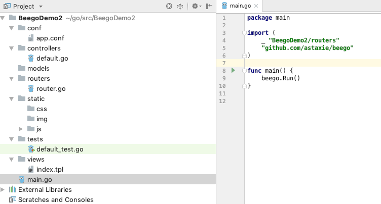
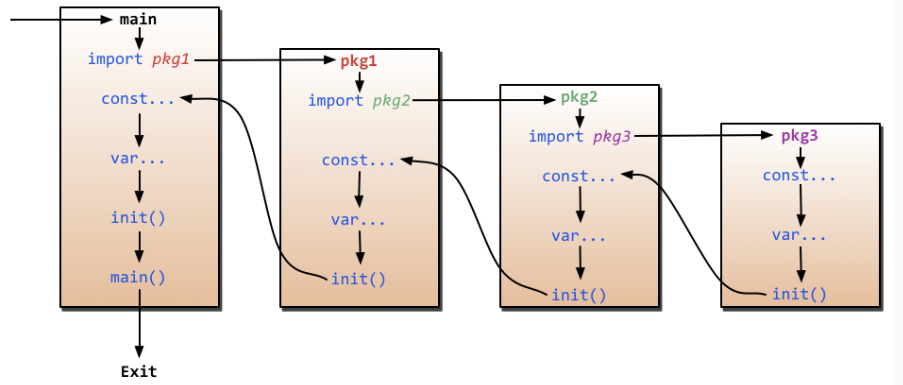

# beego framework introduction and process analysis

**@author: Davie**
**Copyright: Beijing Qianfeng Internet Technology Co., Ltd.**

Starting today, we have begun to enter a new stage of learning. Starting today, we will start learning a new framework knowledge-the Beego actual combat project of GoWeb development.

* Beego official document: [https://beego.me/](https://beego.me/)

# One, beego framework introduction
## 1.1 Introduction to beego framework--Introduction to beego
#### 1.1.1 What is beego
Beego is a GoWeb framework that uses the Go language to develop WEB references. The framework started in 2012 and was written and made public by a Chinese programmer. Its purpose is to provide you with an efficient web application development framework. The framework adopts module encapsulation, which is simple to use and easy to learn. It is convenient for technical developers to quickly learn and carry out actual development. For programmers, beego is very simple to master. You only need to pay attention to the realization of business logic. The framework automatically provides different module functions for project requirements.

After having a simple and basic understanding of the beego framework, we will introduce some features of beego to you.

#### 1.1.2 Beego framework features
The main features of the Beego framework:

**1) Simplification: **RESTful support, MVC model; bee tools can be used to improve development efficiency, such as monitoring code modification for hot compilation, automated test code, and automated packaging deployment and other rich development and debugging functions.

**2) Intelligence: **The beego framework encapsulates the routing module, supports smart routing, smart monitoring, and can monitor memory consumption, CPU usage, and the running status of goroutine, facilitating developers to monitor and analyze online applications.

**3) Modularity: **beego couples and encapsulates the code according to functions, forming independent modules such as Session, Cache, Log, configuration analysis, performance monitoring, context operation, ORM, etc., which are convenient for developers to use.

**4) High performance: **beego uses Go's native http request, and the concurrent efficiency of goroutine can cope with high-traffic web applications and API applications.

You need to remember several features of beego. On the one hand, during the interview process, if an interviewer asks you about the relevant knowledge of goweb development, you may ask about the advantages or features of the beego framework. At this time, you need to be able to I will give an introduction to these features of the beego framework; on the other hand, in the actual learning and coding process later, everyone will feel the convenience and efficiency that these features bring to us in actual projects.

## 1.2 Introduction to beego framework--beego installation
After a brief understanding of the characteristics of beego, we really started to build the environment of beego and began to enter the actual coding stage.

First, we install the beego source code. Speaking of the source code installation of beego, we need to use a command here. Should everyone have been exposed to this command before? We use the go get command to install beego.

#### 1.2.1 Go language version requirements
** [Note]: ** When installing, there is one thing everyone should pay attention to. The beego framework requires Go language version 1.1+. This version of us should also be at least 1.9. There should be none. Or you can run go version on the command line to check your go language version, as shown below:


The above figure shows that the local environment Go language version is version 1.10.4.

#### 1.2.2 beego installation command
Now, let's execute the installation command:
```go
go get github.com/astaxie/beego
```
Waiting for go to download and install the source code, we can find the beego framework source code in the src directory under the GOPATH set by ourselves.

#### 1.2.3 Write the first beego program

So, let's first look at the simplest example of the beego project. This example is one sentence:
* 1. Write the first beego sample project

    ```
    package main
    import "github.com/astaxie/beego"
    func main() {
        beego.Info("The first beego case")
        beego.Run("localhost:8080")
    }
    ```
* 2. Compile
    ```
    go build -o hello hello.go
    ```
    
* 3. Execution
    ```
    ./hello
    ```
* 4. Effect query
    ```
    Visit browser http://localhost:8080
    ```
We visit in the browser: [http://localhost:8080](http://localhost:8080), we can see that a 404 appears in our browser, which means that the page is not found; this is good Understand, because the default page is not specified, the background project does not know which page path it points to by default, so it prompts 404. However, looking at the log output from the background, it shows that the request from the front end is indeed executed in the main method of the background.

## 1.3 Introduction to beego framework-command line tool Bee
Now, try to modify the code, simply add a line to print the log: beego.Info("code modification"). At this time, if we want the code to take effect, we must stop the original program being executed, and then re-execute the code and run the command. Let's try it out.

After our attempts, we can find that the program that was restarted the second time indeed printed out two background logs, which shows that our modified code has taken effect.

Now let us introduce a tool of beego: **bee**.

#### 1.3.1 What is bee
Bee is a development tool that assists in project creation, operation, hot deployment and other related project management tools when developing projects with the Beego framework. Beego is the source code, responsible for development, and bee is the tool, responsible for building and managing projects. When I introduced the characteristics of beego, I mentioned that beego supports hot code deployment. The so-called hot deployment means that when you modify the code, you can restart without stopping the service. The built-in beego can perceive the source code program coding in real time and take effect in real time. This is hot deployment, which greatly facilitates developers and maintainers. The process of service stop and service restart should be carried out frequently. Now, let’s take a look at what functions bee has and how to operate it?

#### 1.3.2 bee installation
Just like beego, if you want to use bee, you must first install it. For the same reason, use the go get command to install the bee tool first. Bee installation command:
```
go get github.com/beego/bee
```

#### 1.3.3 Bee common function commands
After the installation is over, enter the directory corresponding to **GOPATH**, and then enter the bin directory, you can see the executable file of bee, this is the executable file of the installed bee tool, in this directory, we Execute the following bee command in the terminal, and then press Enter, you will find a lot of bee usages are listed, as shown in the figure below:
* new command:  
```
bee new ProjectName
```
This command means to create a new web project. One thing to note: This command must be executed in the src directory to take effect, and the directory structure of the web project is automatically generated. If you execute the bee new command in another directory, the directory structure corresponding to the new project will also be generated under the src directory. This is the directory that the bee tool searches for by default when building the project.
    
* api command:  
```
bee api ProjectNames
```
This command is used to create and develop API applications. Many users write the front-end backend interface through go, so Bee provides a command to write api interface applications. It can be seen from the directory structure that compared with the Web project, the API project has less static and views directories, and an additional test directory. Test is used to write test case code.
        
* run command:  
```
bee run 
```
Commands are used to run the project, and can perform hot deployment and update of code in real time by monitoring the file system. That is, our code logic has been modified, and the changes can be seen on the front-end page without stopping the application.
        
* pack command:
```
bee pack
```
The pack command is used for large package operations when publishing applications. This command will package the project into a zip package, and then we can directly upload the packaged project to the server during deployment, and then unzip it for deployment.
    
* version command:
```
bee version
```
The version command is used to view the current version of bee, beego, and go.

## 1.4 Introduction to beego framework-use Bee tool

The common bee tool commands are the above ones, let’s practice and use them now. Open a command line terminal, enter the directory corresponding to GOPATH, and then enter the src directory.

#### 1.4.1 Use bee to create a project
Use the bee run command to create a new case project. For example, if we create a new BeegoDemo2 project, we execute the command:
```go
bee new BeegoDemo2
```
The command execution effect is as follows:

As you can see, the icon and version of bee are output in the terminal, a lot of logs are printed, and a lot of files and directories are created. This is the execution effect of the bee new command, which means to create a new project.

#### 1.4.2 View project structure
Use our development company goland to open the newly created BeegoDemo2 project, and check the project directory organization structure:


#### 1.4.3 Run a new project
Now use the bee command to run the case and see the effect. In the terminal under the development tool, open the terminal and enter the command:
```go
bee run
```

#### 1.4.4 Project operation effect
The operation effect is as follows:


You can see the output log saying that the http service is already running on the [http://localhost:8080](http://localhost:8080) port. Now we go to the browser to verify it, and the effect is as follows:


# Two, beego program flow analysis
## 2.1 Beego program flow analysis--beego program entry

When the Go language is executed, the init function under the main package is executed, and the main function is executed in turn. Therefore, first find the main.go file.


The above picture shows the content of the main.go file, so how does the code execute? First, import imports two packages, one is routers and the other is beego. In front of the router package, you can see an "_", which indicates that the router package is imported and the init method is executed.

## 2.2 beego program flow analysis-Go language program execution sequence
A knowledge point is involved here, which is the execution process of the Go language. Here is a flowchart of program execution:


## 2.3 Beego program flow analysis-request interception and routing distribution

According to the above figure, you can know that the program first executes the init method under the routers package. Look at the specific code in router.go:


You can see that there is an init method in the router.go file, and see the code of beego.Router().

## 2.4 Beego program flow analysis-controller processing

Router represents the meaning of routing. The function of this function is to map URL to controller. The first parameter is URL (the address requested by the user). The registered here is /, which is the URL without any parameters. One parameter is the corresponding Controller, and the request will be distributed to that controller to execute the corresponding logic. Now go to the MainController set here to see what methods are available:


The MainController structure and functions are declared in the default.go file. And here you see a Get method, there are three lines of code in the method.

The above access in the browser is: [http://localhost:8080](http://localhost:8080), this is a get request. After the request reaches the background, there are no request parameters. Therefore, it will The code that is intercepted by "/" and executed to MainController, because it is a get request, the Get function is automatically found and executed here.

In the get function, there are three lines of code. The first two sentences c.Data[]= "" means setting the returned data field and content, and the last sentence c.TplName means setting the processing request to point to a template file, here it points to the index. tpl, where is the index.tpl file? You can view the project directory structure, under views, some template files are stored under views.

* **Template file**  

    To explain briefly, the usual pages use static html+css+js and other static codes for page layout, page effect control, etc., and the page data is represented by variables, so that when the page is displayed, It can automatically fill in the values ​​of the variables in the page; these static code files are collectively referred to as template files. Each template file is like a template, the style effect is fixed, but it is rendered and displayed according to different data.
    
## 2.4 Beego program flow analysis--beego.Run() logic
After the analysis of the init method is completed, the program will continue to execute, and it will reach the main function, which is executed in the main function: beego.Run() code. Analyze the logic of the Run code. Inside the Run method, several things are mainly done:

* Parse the configuration file, which is our app.conf file, such as port, application name and other information.

* Check whether the session is opened. If the session is opened, a session object will be initialized.

* Whether to compile the template or not, the beego framework will precompile all the templates in the views directory according to the configuration when the project starts, and then store them in the map, which can effectively improve the efficiency of template operation without requiring multiple compilations.

* Monitoring service port. Start listening according to the port configuration in the app.conf file.

