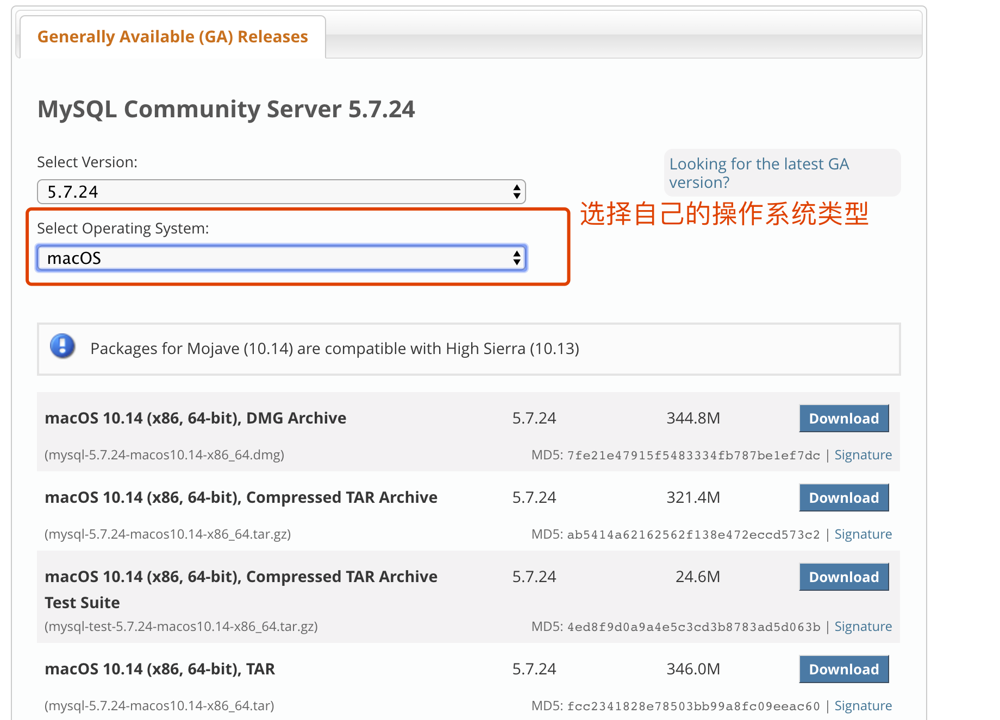
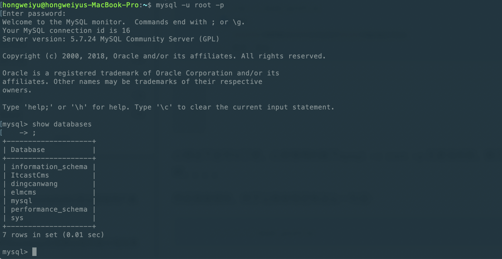

# beego framework summary and database connection configuration
**@author: Davie**
**Copyright: Beijing Qianfeng Internet Technology Co., Ltd.**

## One, beego framework summary
### 1.1 Beego project organization structure
The course content of the previous section conducted a simple analysis of the beego case code, and summarized the organizational structure of the beego project, which is summarized as follows:

#### 1.1.1 Project configuration: conf
The directory where the project configuration file is located. Some global configurations in the project can be placed in this directory. Three configurations are specified by default in the default app.conf file:

* appname = BeegoDemo2: ** Specify the project name.

* httpport = 8080: ** Specify the monitoring port of the project service.

* runmode = dev: ** Specify the execution mode.
    
#### 1.1.2 Controller: controllers
This directory is the directory where the controller files are stored. The so-called controller is to control which business logic the application calls. After the controllers process the http request, they are responsible for returning it to the front-end caller.

#### 1.1.3 Data layer: models
The models layer can be interpreted as the entity layer or the data layer. The processing of user and business data is implemented in the models layer. Some operations related to database tables will be implemented in this directory, and then the result data after execution will be returned to the controller. Floor. For example, inserting new data into the database, deleting database table data, modifying a piece of data, and querying business data from the database are all implemented in the models layer.

#### 1.1.4 Routing layer: routers:
This layer is the routing layer. The so-called routing means distribution. When the front-end browser makes an http request to reach the back-end web project, the program must be able to perform different business processing according to the browser's request url, from receiving the front-end request to judging and executing specific business logic The work of the process is realized by routers.

#### 1.1.5 Static resource directory: static
In the static directory, the static resource files of the web project are stored, mainly including css files, img, js, and html files. The static page files of the application will be stored in the html.

#### 1.1.6 View template: views
What is stored in views is the directory where html template pages are stored in the application. The so-called template means that the frame and layout of the page have been written in html. You only need to dynamically fill the page with the acquired data during access and display, which can improve rendering efficiency. Therefore, template files are a very common way.

In summary, the entire project architecture is the operating mode of MVC. You should be familiar with common architecture patterns such as: MVC, MVP, MVVM and other architectures. Here we use MVC, which is clear and easy to understand.

### 1.2 Beego framework routing settings
In the beego framework, four routing settings are supported. They are: **Basic routing**, **Fixed routing**, **Regular routing** and **Auto routing**.

#### 1.2.1 Basic routing:
Directly use beego.Get, beego.POST, beego.Head, beego.Delete and other methods to map the route. We will show you the code through the code. We know that the common http request method operations are: GET, HEAD, PUT, POST, DELETE, OPTIONS, etc.
* GET routing
The first is basic GET routing. Let's show you through examples.

    ```go
    beego.GET("",func)
    ```

* POST routing:

    ```go
    beego.POST("",func)
    ```

* In addition, basic routing such as Patch, Head, and Delete is also supported.

The above kind of request and the corresponding way to find the request method type is the RESTful form, and our most commonly used form is also the RESTful form.
RESTful is a very commonly used form in API development. In fact, the RESTful form is that when the user makes a get request, the Get method is automatically executed, and the Post request executes the Post method.
    
#### 1.2.2 Fixed routing:
Code forms such as the following:
    
```
beego.Router("/",controller);
```

The Get request corresponds to the Get method, Post corresponds to the Post method, Delete corresponds to the Delete method, and the Header method corresponds to the Header method.

#### 1.2.3 Regular routing:
Regular routing refers to a regular expression that can match a certain format on the basis of fixed routing. For example: id, :username, custom regular, file path and suffix switching, and full matching operations.
    
#### 1.2.4 Custom routing
The above two routes are the default. According to the type of request, Get executes the Get method, and Post executes the Post method, which is more limited. Because most of the development uses fixed matching to directly execute the corresponding logic control method, beego provides us with custom routing configurations that can be customized. The way is as follows:
```
beego.Router("/",&IndexController{},"")
```
Available HTTP Method:
* "*": contains all the following functions
* "get": GET request
* "post": POST request
* "put": PUT request
* "delete": DELETE request
* "patch": PATCH request
* "options": OPTIONS request
* "head": HEAD request

The above corresponding request methods, in beego.Controller, define many methods, such as Init, Prepare, Post, Get, Head, Delete and other methods. The above analysis is the running logic of the Router and Controller of the beego framework.

### 1.3 Model layer analysis
In the process of web development, developers manipulate data, and the most commonly used to store data is database operation. Database operation is an independent module. This will be implemented with you in specific projects later.

### 1.4 view writing
The static html template files of the actual combat project and some other static resources have been written and provided to the developers and can be used directly in the project. In the actual development process, everyone is required to master html, js grammar and simple css grammar to be able to understand and be able to use it easily in time. More complex front-end pages or static pages need to be connected with front-end developers. The focus of development is on the background server, so you only need to learn to use and invoke debugging.

### 1.5 Setting of static files
In the goweb project, as mentioned above, there are some static resource files. If users want to access static resource files, we should also be able to access them. This requires static resource settings in our project.
The setting method is:
```
beego.SetStaticPath("/down1","download1")
```
The download directory here refers to the directory under the static directory of the non-goweb project, but a new directory created by the developer.

### 1.6 Introduction to actual combat projects
In this series of courses, we use the Beego framework to develop and implement a blog system. As shown below:


# Two, database configuration and connection test
### 2.1 mysql database installation
mysql official download site: [https://dev.mysql.com/downloads/](https://dev.mysql.com/downloads/)
We are using version 5.7, download link: [https://dev.mysql.com/downloads/mysql/5.7.html#downloads](https://dev.mysql.com/downloads/mysql/5.7.html# downloads)



Choose to download the installation file and install it locally.
During the installation process, if the initial password appears, remember the password and use it when logging in for the first time.

**[Note] Windows installation instructions: [https://jingyan.baidu.com/article/09ea3ededa53b7c0aede39b5.html](https://jingyan.baidu.com/article/09ea3ededa53b7c0aede39b5.html)**

After the installation is complete, add the mysql bin directory path to the environment variable so that you can log in to mysql in the terminal command line.

The command to log in to mysql in the terminal:
```
mysql -u root -p
```

Enter the password you set during installation or you can log in successfully. As follows:

As shown in the figure above, the login is successful. In order to use your own password, you can set a password you are familiar with so that you can remember it easily.

### 2.2 Common commands of mysql database
Some commands of mysql database are used:
* View the database:

    ```
    show databases;
    ```
* Use a database:

    ```
    use databaseName;
    ```

* Display a list of database tables:

    ```
    show tables;
    ```
    
* Some other commands in mysql:

    
    
The above mysql data operations are all in the form of a command line terminal. In order to facilitate our daily operations, we can use a graphical interface tool. Here we use the Navicat tool. We now look at how to proceed with the installation.

### 2.3 Navicat installation
Navicat tool download address: [https://www.navicat.com/en/download/navicat-for-mysql](https://www.navicat.com/en/download/navicat-for-mysql)

In the above link, select your own system version, then download the installation file, and install it. The next step is always selected by default, and the installation is successful.

After the installation is complete, create a new database in the mysql database, such as the name: **myblog**; After creating the database, let's take a look at how to use the mysql database in the beego project.

### 2.4 Database Driver

As we said before, database programming belongs to the Models layer in beego, also known as the ORM module.

In beego, currently supports three database drivers, namely:

* **MySQL:** [github.com/go-sql-driver/mysql](github.com/go-sql-driver/mysql)
* **PostgreSQL:**[github.com/lib/pq](github.com/lib/pq)
* **Sqlite3: **[github.com/mattn/go-sqlite3](github.com/mattn/go-sqlite3)

Several features of ORM in beego:

* **Support all types of storage in Go language**

* **CRUD operation is simple**

* **Auto Join Association Table**

* **Allow direct use of SQL queries**


### 2.5 Use mysql in beego project

#### 2.5.1 Import the corresponding database driver
For example, mysql:
```
import _ "github.com/go-sql-driver/mysql"
```


#### 2.5.2 Register the driver and connect to the database
Register the database driver and connect to the database through the following two sentences:
```
orm.RegisterDriver("mysql",orm.DRMySQL)
orm.RegisterDataBase(aliasName,driverName,dbConn)
```
The detailed code is as follows:


#### 2.5.3 Create database and execute program


The code to connect to the database is as follows:

```
package models
    
import (
	"github.com/astaxie/beego"
	"github.com/astaxie/beego/orm"
	"BlogProject/MysqlDemo/util"
	//Remember: Import the driver package
	_ "github.com/go-sql-driver/mysql"
)
    
func init() {
	driverName := beego.AppConfig.String("driverName")
    
	//Register the database driver
	orm.RegisterDriver(driverName, orm.DRMySQL)
    
	//Database linkage
	user := beego.AppConfig.String("mysqluser")
	pwd := beego.AppConfig.String("mysqlpwd")
	host := beego.AppConfig.String("host")
	port := beego.AppConfig.String("port")
	dbname := beego.AppConfig.String("dbname")
    
	//dbConn := "root:yu271400@tcp(127.0.0.1:3306)/cmsproject?charset=utf8"
	dbConn := user + ":" + pwd + "@tcp(" + host + ":" + port + ")/" + dbname + "?charset=utf8"
    
	err := orm.RegisterDataBase("default", driverName, dbConn)
	if err != nil {
		util.LogError("Error connecting to database")
		return
	}
	util.LogInfo("Connect to the database successfully")  
}
```

#### 2.5.4 Program execution results

    


Note: The article uses some links to external web pages, and the content comes from public content. Invasion delete.

