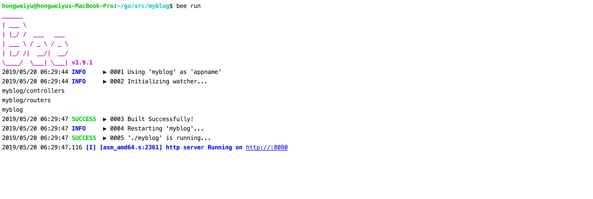
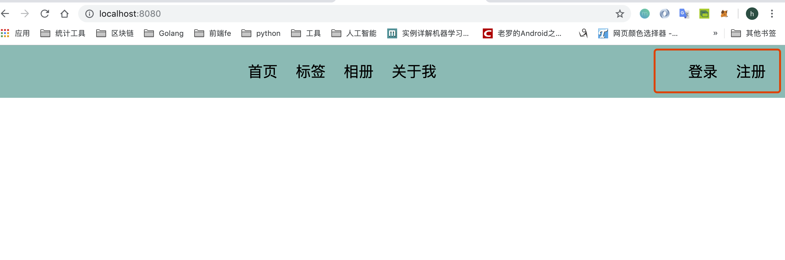
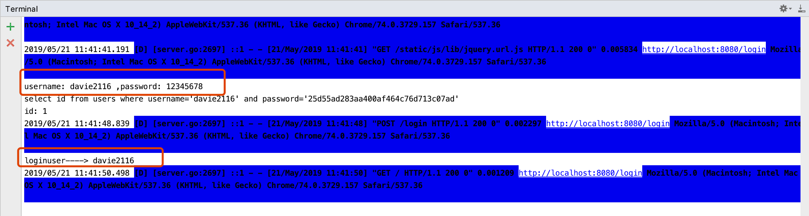

# Project construction, login and registration, and Session function development  
**@author: Davie**  
**Copyright: Beijing Qianfeng Internet Technology Co., Ltd.**

## A project to build and register user functions
### 1.1 Project Construction
#### 1.1.1 Create a project
First open the terminal and enter the src directory under gopath, and then execute the following command to create a beego project:

```shell
bee new myblog
```

The operation effect is as follows:


Then open the project through goland:


#### 1.1.2 Modify port configuration
We open the configuration file under the conf package: app.conf file, and modify the port number to 8080:

```go
appname = myblog
httpport = 8080
runmode = dev
```

#### 1.1.3 Project operation and effect
Then enter the project directory in the terminal, and then run the project:


We can see that the project is already running and listening on port 8080. Next, we open the browser and enter the URL: [http://127.0.0.1:8080/](http://127.0.0.1:8080/), and then you can see the welcome interface:


### 1.2 User registration function

#### 1.2.1 Database creation and connection

First of all, we create a database:


We first create a toolkit utils, and then create a go file, which is used as a mysql tool class, which provides the functions of connecting to the database and creating tables.

First provide an initialization method:
```
func InitMysql() {

	fmt.Println("InitMysql....")
	driverName := beego.AppConfig.String("driverName")

	//Register the database driver
	orm.RegisterDriver(driverName, orm.DRMySQL)

	//Database linkage
	user := beego.AppConfig.String("mysqluser")
	pwd := beego.AppConfig.String("mysqlpwd")
	host := beego.AppConfig.String("host")
	port := beego.AppConfig.String("port")
	dbname := beego.AppConfig.String("dbname")

	//dbConn := "root:yu271400@tcp(127.0.0.1:3306)/cmsproject?charset=utf8"
	dbConn := user + ":" + pwd + "@tcp(" + host + ":" + port + ")/" + dbname + "?charset=utf8"

	//dbConn := "root:yu271400@tcp(127.0.0.1:3306)/cmsproject?charset=utf8"
	dbConn := user + ":" + pwd + "@tcp(" + host + ":" + port + ")/" + dbname + "?charset=utf8"

	db, _ = sql.Open(driverName, dbConn)
```

#### 1.2.2 Database table design
Then design the data table, we need the user id, and as the primary key, username username and password password, and status status, this is used to mark whether the user is deleted, 0 means normal status, 1 means delete. Also is the registration time, we can use the integer timestamp to represent, so the sql statement is as follows: you can directly manipulate the database to create, or you can create it through code:

```go
//Create user table
func CreateTableWithUser() {
	sql := `CREATE TABLE IF NOT EXISTS users(
		id INT(4) PRIMARY KEY AUTO_INCREMENT NOT NULL,
		username VARCHAR(64),
		password VARCHAR(64),
		status INT(4),
		createtime INT(10)
		);`

	ModifyDB(sql)
}
```

#### 1.2.3 Database operation method
Then provide a method for executing SQL statements:

```go
//Operate the database
func ModifyDB(sql string, args ...interface{}) (int64, error) {
	result, err := db.Exec(sql, args...)
	if err != nil {
		log.Println(err)
		return 0, err
	}
	count, err := result.RowsAffected()
	if err != nil {
		log.Println(err)
		return 0, err
	}
	return count, nil
}
```

Provide another method for subsequent database operations:

```go

//Inquire
func QueryRowDB(sql string) *sql.Row{
	return db.QueryRow(sql)
}
```

#### 1.2.4 Define User and database operation methods
Then create a model file in models:

```go
package models

import (
	"myblogweb/utils"
	"fmt"
)

type User struct {
	Id int
	Username string
	Password string
	Status int // 0 normal status, 1 delete
	Createtime int64
}

//--------------Database operation-----------------

//insert
func InsertUser(user User)(int64, error){
	return utils.ModifyDB("insert into users(username,password,status,createtime) values ​​(?,?,?,?)",
		user.Username,user.Password,user.Status,user.Createtime)
}

//Query by condition
func QueryUserWightCon(con string)int{
	sql := fmt.Sprintf("select id from users %s",con)
	fmt.Println(sql)
	row:=utils.QueryRowDB(sql)
	id :=0
	row.Scan(&id)
	return id
}

//Query id based on username
func QueryUserWithUsername(username string) int{
	sql := fmt.Sprintf("where username='%s'",username)
	return QueryUserWightCon(sql)
}

//Query id based on user name and password
func QueryUserWithParam(username ,password string)int{
	sql:=fmt.Sprintf("where username='%s' and password='%s'",username,password)
	return QueryUserWightCon(sql)
}
```

#### 1.2.5 Create register.html registration file
We first create an html page under the views package: register.html.
```html


    
   
    
    
   
    
   
    
    
    


    
   

        
    
 
     

     
          
    Log in
     
          
    register
     
         

 
    

    
   


    
   

        
    
 
      
     
 
      
Welcome
 
      
 
        
        
        
       
 
       

 
      
 
     
 {{/*Background animation*/}} 
     

     
          
     
          
     
          
     
          
     
          
     
          
     
          
     
          
     
          
     
          
     
         

 
    

    
   


```

#### 1.2.6 Add user registration logic verification
Add form validation: We use jquery to implement the js part, create a subdirectory lib under the js directory, put jquery framework files in it, and introduce it into the page.

Then re-create a js file: blog.js
First add form validation:
```js
$(document).ready(function () {
    //Registration form verification
    $("register-from").validate({
        rules:{
            username:{
                required:true,
                rangelength:[5,10]
            },
            password:{
                required:true,
                rangelength:[5,10]
            },
            repassword:{
                required:true,
                rangelength:[5,10],
                equalTo:"#register-password"
            }
        },
        messages:{
            username:{
                required:"Please enter your username",
                rangelength: "User name must be 5-10 digits"
            },
            password:{
                required:"Please enter a password",
                rangelength: "Password must be 5-10 digits"
            },
            repassword:{
                required:"Please confirm your password",
                rangelength: "Password must be 5-10 digits",
                equalTo: "The password entered twice must be equal"
            }
        },
        submitHandler:function (form) {
            var urlStr = "/register";
            // alert("urlStr:"+urlStr)
            $(form).ajaxSubmit({
                url:urlStr,
                type:"post",
                dataType:"json",
                success:function (data,status) {
                    alert("data:"+data.message)
                    if (data.code == 1){
                        setTimeout(function () {
                            window.location.href="/login"
                        },1000)
                    }
                },
                err:function (data,status) {
                    alert("err:"+data.message+":"+status)
                }
            })
        }
    })
})
```
When the user clicks the submit button of the form, it will jump to the /register path, and because it is set as a post request, we can complete the registration of the form in the post. If the registration is successful, then jump to the /login path.

#### 1.2.7 Controller Development (controller)
We create a new controller under the controllers package to handle user registration:

```go
package controllers

import "github.com/astaxie/beego"

type RegisterController struct {
	beego.Controller
}

func (this *RegisterController) Get(){
	this.TplName = "register.html"
}

```

#### 1.2.8 Add route resolution
Next, we need to register a new route and modify the router.go file:
```go
func init() {
    beego.Router("/", &controllers.MainController{})
    beego.Router("/register", &controllers.RegisterController{})
}
```

#### 1.2.9 Post method coding implementation
We create a Post() method to handle post requests:
```go

//Process registration
func (this *RegisterController) Post() {
	//Get form information
	username := this.GetString("username")
	password := this.GetString("password")
	repassword := this.GetString("repassword")
	fmt.Println(username, password, repassword)

	//Before registering, first judge whether the user name has been registered, if it is already registered, return an error
	id := models.QueryUserWithUsername(username)
	fmt.Println("id:",id)
	if id> 0 {
		this.Data["json"] = map[string]interface{}{"code":0,"message":"Username already exists"}
		this.ServeJSON()
		return
	}

	//Register username and password
	//The stored password is the data after md5, so when verifying the login, it is also necessary to judge the user's password after md5 and the password in the database
	password = utils.MD5(password)
	fmt.Println("md5 after:",password)

	user := models.User{0,username,password,0,time.Now().Unix()}
	_,err :=models.InsertUser(user)
	if err != nil{
		this.Data["json"] = map[string]interface{}{"code":0,"message":"Registration failed"}
	}else{
		this.Data["json"] = map[string]interface{}{"code":1,"message":"Registered successfully"}
	}
	this.ServeJSON()
}
```
The idea is to first receive the form information, and then determine whether the user name already exists in the database, if it already exists, then registration cannot be performed, we can return the information through json: the user name already exists.

Otherwise, register again. For the sake of password security, we can store the md5 encrypted data of the password in the database.

#### 1.2.10 Tool method
So in the toolkit, add another tool class: myUtils.go

```go
package utils

import (
	"fmt"
	"crypto/md5"
)

//The incoming data is different, then the 32-bit data after MD5 will definitely be different
func MD5(str string) string{
	md5str:=fmt.Sprintf("%x",md5.Sum([]byte(str)))
	return md5str
}

```

#### 1.2.11 Project Operation
We open the terminal, enter the directory where the project is located, and execute the command:  
```
bee run
```


After the project is started, it is monitored on port 8080.

And the InitMysql() method is executed to initialize the database, we open the database to refresh, and a data table user has been created:


Open the browser and enter the following URL: [http://localhost:8080/register](http://localhost:8080/register), and then enter the user name and password to register.


Here, you can try repeatedly, such as the username length is not enough, repeated passwords are inconsistent, the same username, etc.

## Two user login function
In the previous chapter, we have realized the registered user name and password. Next we implement login.
### 2.1 Define LoginController
First create a new go file to define a new Controller:
```go
type LoginController struct {
	beego.Controller
}
func (this *LoginController) Get() {
	this.TplName = "login.html"
}
```
### 2.2 Register and login function routing
Then register a new route:
```go
func init() {
    beego.Router("/", &controllers.MainController{})
    beego.Router("/register", &controllers.RegisterController{})
    beego.Router("/login", &controllers.LoginController{})
}
```
### 2.3 Added Post method to handle login requests
Then add a Post method:
```go
func (this *LoginController) Post() {
	username := this.GetString("username")
	password := this.GetString("password")
	fmt.Println("username:", username, ",password:", password)
	id := models.QueryUserWithParam(username, utils.MD5(password))
	fmt.Println("id:",id)
	if id> 0 {
		this.Data["json"] = map[string]interface{}{"code": 1, "message": "Login successful"}
	} else {
		this.Data["json"] = map[string]interface{}{"code": 0, "message": "Login failed"}
	}
	this.ServeJSON()
}
```

### 2.4 Model operation of user login

In the previous Post method, we have received the user name and password from the page, and then add a method to user_model.go to query the id based on the user name and password to indicate whether the user name and password are correct.
```go
//Query id based on user name and password
func QueryUserWithParam(username ,password string)int{
	sql:=fmt.Sprintf("where username='%s' and password='%s'",username,password)
	return QueryUserWightCon(sql)
}
```
### 2.5 View layer development
#### 2.5.1 Create a new login.html file
We recreate an html page under the views package, login.html, with the following content:
```html


    
   
    
    
   
    
   
    
    
    


   

    
    
 
     

     
          
    Log in
     
          
    register
     
         

 
    


   


   

    
    

      {{/*Registration Form*/}} 
     
 
      
Welcome
 
      
 
        
        
       
 
       

 
      
 
     
 {{/*Background animation*/}} 
     

     
          
     
          
     
          
     
          
     
          
     
          
     
          
     
          
     
          
     
          
     
         

 
    


   


```
> Because the content is similar to the registration page, you can copy the content of the registration page, but pay attention to the difference in tag id and so on.

#### 2.5.2 js implements login logic verification
Next, we implement the js part, add code in blog.js to implement the login part:

```js
    //Log in
    $("#login-form").validate({
        rules:{
            username:{
                required:true,
                rangelength:[5,10]
            },
            password:{
                required:true,
                rangelength:[5,10]
            }
        },
        messages:{
            username:{
                required:"Please enter your username",
                rangelength: "User name must be 5-10 digits"
            },
            password:{
                required:"Please enter a password",
                rangelength: "Password must be 5-10 digits"
            }
        },
        submitHandler:function (form) {
            var urlStr ="/login"
            alert("urlStr:"+urlStr)
            $(form).ajaxSubmit({
                url:urlStr,
                type:"post",
                dataType:"json",
                success:function (data,status) {
                    alert("data:"+data.message+":"+status)
                    if(data.code == 1){
                        setTimeout(function () {
                            window.location.href="/"
                        },1000)
                    }
                },
                error:function (data,status) {
                    alert("err:"+data.message+":"+status)
                }
            });
        }
    });
```

### 2.6 Project Operation
After starting the project, open the browser and enter the following access path: [http://127.0.0.1:8080/login](http://127.0.0.1:8080/login) Then enter the user name and password, and log in, the page returns to the information The sequence is as follows:


## Three Project Session Processing
### 3.1 Introduction to Session Usage Scenarios
We hope that the user can have the function of blogging after logging in, and of course, we also allow the user to log out:


If the user is not logged in and directly visits the homepage, he can only view articles, tags, albums, etc., but does not have the function of blogging:


The operation to achieve this function requires the use of session.

### 3.2 Sesion function added
#### 3.2.1 Enable Sesion function
First, we add session when logging in.
First modify the configuration file to open the session, open the app.conf file under the conf package, and add a line:

```go
appname = myblog
httpport = 8080
runmode = dev

sessionon = true
```

Or open the session in main.go:
```go
func main() {
	utils.InitMysql()
	beego.BConfig.WebConfig.Session.SessionOn = true // open session
	beego.Run()
}
```

> For the above two operations, just select one.

#### 3.2.2 Add session processing for login function
Then modify the Post method of login. When logging in, we set the session:
```go
func (this *LoginController) Post() {
	...
	if id> 0 {
		/*
		I regret setting the session and set the data processing to the cookie, and then automatically bring the cookie when the browser makes a network request
		Because we can determine who the user is by getting this cookie, here we use the session method to set
		 */
		this.SetSession("loginuser", username)
		this.Data["json"] = map[string]interface{}{"code": 1, "message": "Login successful"}
	} else {
		this.Data["json"] = map[string]interface{}{"code": 0, "message": "Login failed"}
	}
	this.ServeJSON()
}
```

#### 3.2.3 Add homepage route
Next, we add a new route:
```go
func init() {
    beego.Router("/", &controllers.HomeController{})
    beego.Router("/register", &controllers.RegisterController{})
    beego.Router("/login", &controllers.LoginController{})
}
```

When visiting /, the root path, we mean visiting the homepage.

#### 3.2.4 Add Home Controller
Next, create a new Controller, HomeController, to control the home page. But before that, we first set up a parent Controller to get the session and check whether the user is logged in.

First create a go file: base_controller.go
```go
type BaseController struct {
	beego.Controller
	IsLogin bool
	Loginuser interface{}
}
```

First define a BaseController, set two additional fields inside, IsLogin indicates whether the user is logged in, Loginuser indicates the user name.

```go
//Determine whether to log in
func (this *BaseController) Prepare() {
	loginuser := this.GetSession("loginuser")
	fmt.Println("loginuser---->", loginuser)
	if loginuser != nil {
		this.IsLogin = true
		this.Loginuser = loginuser
	} else {
		this.IsLogin = false
	}
	this.Data["IsLogin"] = this.IsLogin
}
```

Take the next class and override the Prepare() method to get the session.

```go
//Determine whether to log in
func (this *BaseController) Prepare() {
	loginuser := this.GetSession("loginuser")
	fmt.Println("loginuser---->", loginuser)
	if loginuser != nil {
		this.IsLogin = true
		this.Loginuser = loginuser
	} else {
		this.IsLogin = false
	}
	this.Data["IsLogin"] = this.IsLogin
}
```

This function is mainly for user extension. This function will be executed before the Method methods defined below. Users can override this function to achieve similar user authentication. Then create a home_controller.go file.

```go
type HomeController struct {
	//beego.Controller
	BaseController
}
```

In the Get() method, just render the home page.

```go
func (this *HomeController)Get(){
	fmt.Println("IsLogin:",this.IsLogin,this.Loginuser)
	this.TplName="home.html"
}
```

#### 3.2.5 View layer development
We need the following functions:

Each subsequent page has these functions. So we can make pages nested.
##### 3.2.5.1 Navigation bar layout
Now create a subdirectory block under the views directory, and create an html page in it: nav.html, with the following content:
```html

   

    
    
 
     


           {{/*If you are already logged in, "blogging" will be displayed*/}} {{if .IsLogin}} 
          
    write a blog
     {{end}} 
         

 
    


    
    
 
     

     
          
    front page
     
          
    Label
     
          
    Photo album
     
          
    about me
     
         

 
    


    
    
 
     


           {{if .IsLogin}} 
          
    quit
     {{else}} 
          
    Log in
     
          
    register
     {{end}} 
         

 
    


   

```

Of course, you need to determine whether the user is logged in. If logged in, the blogging function will be displayed and you can log out. Otherwise, login or registration is displayed.
##### 3.2.5.2 Home view home.html
Next, we create a new page: **home.html**, with the following content:
```html


    
   
    
    
   


{{template "block/nav.html" .}}


```

Through the nesting of the page, we can display the label on the home page.

> Pay special attention to {{template "block/nav.html" .}}, followed by `.`, which is to pass the current parameters to the sub-template

##### 3.2.5.3 Adapt to existing view files
Similarly, we will nest the previous login.html page and register.html page with nav, the code is as follows:

login.html
```html


    
   
    
    
   
    
   
    
    
    


   
{{template "block/nav.html"}}


   

    
    

      {{/*Registration Form*/}} 
     
 
      
Welcome
 
      
 
        
        
       
 
       

 
      
 
     
 {{/*Background animation*/}} 
     

     
          
     
          
     
          
     
          
     
          
     
          
     
          
     
          
     
          
     
          
     
         

 
    


   


```

register.html
```html


    
   
    
    
   
    
   
    
    
    


   

{{template "block/nav.html"}}


   

    
    

      {{/*Registration Form*/}} 
     
 
      
Welcome
 
      
 
        
        
        
       
 
       

 
      
 
     
 {{/*Background animation*/}} 
     

     
          
     
          
     
          
     
          
     
          
     
          
     
          
     
          
     
          
     
          
     
         

 
    


   


```

#### 3.2.6 Add exit script
Let's first add the exit script in the nav.html page:
```html
    
   

        
    


          {{if .IsLogin}} 
         
    quit
     {{else}} 
         
    Log in
     
         
    register
     {{end}} 
        


    
   

```

#### 3.2.6 Add exit route
Then re-register a route to handle the exit:
```go
func init() {
    beego.Router("/", &controllers.HomeController{})
    //register
    beego.Router("/register", &controllers.RegisterController{})
    //Log in
    beego.Router("/login", &controllers.LoginController{})
    //quit
	beego.Router("/exit", &controllers.ExitController{})

}
```

#### 3.2.7 Add exit function controller
Then create a go file: exit_controller.go
```go
package controllers

type ExitController struct {
	BaseController
}

func (this *ExitController)Get(){
	//Clear the data of the user's login status
	this.DelSession("loginuser")
	this.Redirect("/",302)
}
```
After clearing the session, relocate to the / path.

#### 3.2.8 Project Operation
After we restart the project, call the browser and enter the URL: [http://127.0.0.1:8080/](http://127.0.0.1:8080/)

The browser is as follows:


The server side runs as follows:


Click the exit button, the background program execution effect:


