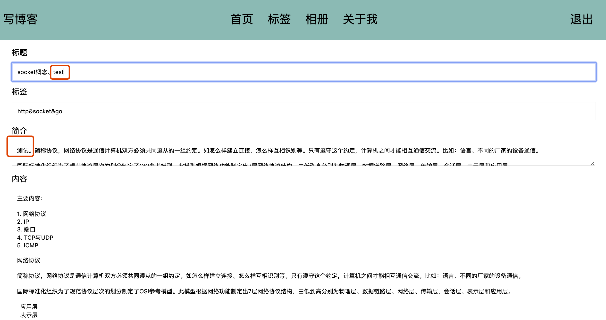
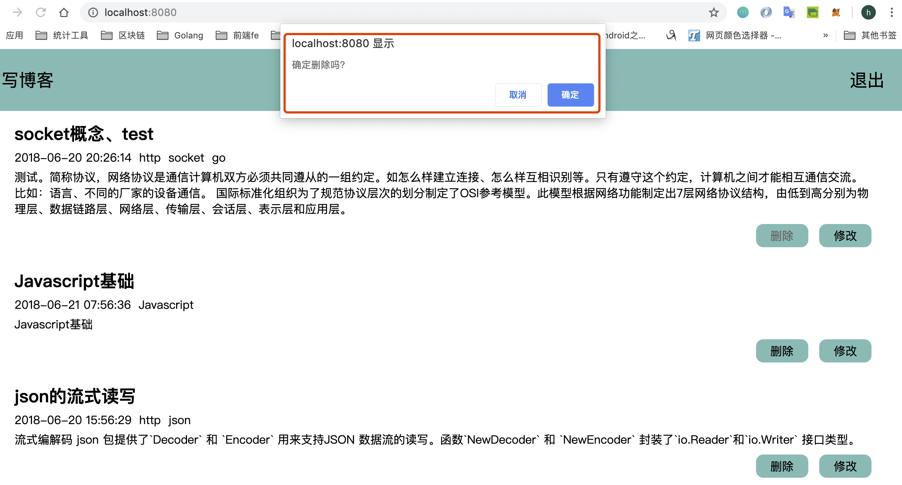
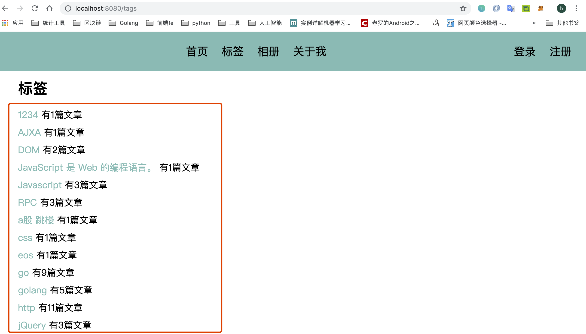

# Modify article, delete article and tag function development
**@author: Davie**  
**Copyright: Beijing Qianfeng Internet Technology Co., Ltd.**

In the last lesson, we learned the function development of viewing article details. In this lesson, we modify the function of the article in advance.

## A modified article function development
### 1.1 Add and modify the article function routing
First, we first add a route:
```go
func init() {
    ...
	//write an essay
	beego.Router("/article/add", &controllers.AddArticleController{})
	//Display article content
	beego.Router("/article/:id", &controllers.ShowArticleController{})
	//Update the article
	beego.Router("/article/update", &controllers.UpdateArticleController{})
}
```
### 1.2 Add a controller to modify the article function
#### 1.2.1 Define and modify the article controller
Then create a new Controller (update_article_controller.go) to control the update operation:
```go
type UpdateArticleController struct {
	BaseController
}
```

#### 1.2.2 Add get method
```go
//When accessing the /update path, the Get() method is triggered, and the response page is the page returned to the client specified by the attribute TplName
func (this *UpdateArticleController) Get() {
	id, _ := this.GetInt("id")
	fmt.Println(id)
	//Get the article information corresponding to the id
	art := models.QueryArticleWithId(id)
	this.Data["Title"] = art.Title
	this.Data["Tags"] = art.Tags
	this.Data["Short"] = art.Short
	this.Data["Content"] = art.Content
	this.Data["Id"] = art.Id
	this.TplName = "write_article.html"
}
```
After clicking the modify button to trigger the route, enter the Get() method through the get request. In fact, the page where the article is written is actually displayed, but the data to be modified is already filled in.
If you want to display the data of the article to be modified on the page, you need to query the article according to the id, and then pass the data to the front-end page.
When the user clicks the submit button, a post request is triggered and the Post() method is entered:
```go
//modify articles
func (this *UpdateArticleController) Post() {
	id, _ := this.GetInt("id")
	fmt.Println("postid:", id)
	//Get the data transmitted by the browser, and get the value through the name attribute of the form
	title := this.GetString("title")
	tags := this.GetString("tags")
	short := this.GetString("short")
	content := this.GetString("content")
	//Instantiate the model, modify the database
	art := models.Article{id, title, tags, short, content, "", 0}
	_, err := models.UpdateArticle(art)
	//Return data to the browser
	if err == nil {
		this.Data["json"] = map[string]interface{}{"code": 1, "message": "Updated successfully"}
	} else {
		this.Data["json"] = map[string]interface{}{"code": 0, "message": "Update failed"}
	}
	this.ServeJSON()
}
```

### 1.3 Views
To modify an article and write an article, we can use the same page, but we need to modify the data on the write_article.html page:
```html


    
   
    
    
   
    
    
    


{{template "block/nav.html" .}}


   

    
    
 
     

      title
     
 
      
     

      Label
     
 
      
     

      Introduction
     
 
     {{.Short}} 
     

      content
     
 
     {{.Content}} 
      
     

 
     

 
    


   


```
Previously, I clicked the submit button to add an article. It is also possible to modify the article now. Whether to modify or add depends on the value of the id on the page. If it is added, the default value of 0 is used. If it is modified, the real value is queried from the database, so you need to modify the js script file:
```js
submitHandler: function (form) {
    alert("hello")
    var urlStr = "/article/add";
    //Judging the article id to determine the server address of the submitted form
    //If the id is greater than zero, it means the article is modified
    var artId = $("#write-article-id").val();
    alert("artId:" + artId);
    if (artId> 0) {
        urlStr = "/article/update"
    }
    alert("urlStr:" + urlStr);
    $(form).ajaxSubmit({
        url: urlStr,
        type: "post",
        dataType: "json",
        success: function (data, status) {
            alert(":data:" + data.message);
            setTimeout(function () {
                window.location.href = "/"
            }, 1000)
        },
        error: function (data, status) {
            alert("err:" + data.message + ":" + status)
        }
    });
```

### 1.4 Model layer add and modify data method
Then we can modify the database. In the article_model.go file, add the method:
```go
//----------change the data----------
func UpdateArticle(article Article) (int64, error) {
	//Database operation
	return utils.ModifyDB("update article set title=?,tags=?,short=?,content=? where id=?",
		article.Title, article.Tags, article.Short, article.Content, article.Id)
}
```

### 1.5 Project Operation
After restarting the project, we call the browser and enter the URL: [http://127.0.0.1:8080/](http://127.0.0.1:8080/)


We will modify the first article:


Submit the modified effect:


You can also query the database, which has also been updated:


## Two delete article function development
After the user logs in, there is a delete function. Click Delete to delete an article. The delete article function does not require the view page, just pop the box to confirm. Now we will implement the model and controller parts.

### 2.1 Model add and delete method
In the article_model.go file, add a method to delete articles:
```go
//----------Delete article---------
func DeleteArticle(artID int) (int64, error) {
	i, err := deleteArticleWithArtId(artID)
	SetArticleRowsNum()
	return i, err
}
func deleteArticleWithArtId(artID int) (int64, error) {
	return utils.ModifyDB("delete from article where id=?", artID)
}
```
When deleting, it must be deleted according to the ID of the article. When the delete button is clicked, the article ID can be passed.

```html
{{if .IsLogin}}
    
   

        
    delete
        
    Revise
    
   

{{end}}
```

### 2.2 Add and delete article controller
Next, we implement the controller part, in the controllers directory, create a new go file: delete_article_controller.go
```go
package controllers
import (
	"fmt"
	"myblogweb/models"
	"log"
)

type DeleteArticleController struct {
	BaseController
}
//Redirect to the homepage after clicking delete
func (this *DeleteArticleController) Get() {
	artID, _ := this.GetInt("id")
	fmt.Println("Delete id:", artID)
	_, err := models.DeleteArticle(artID)
	if err != nil {
		log.Println(err)
	}
	this.Redirect("/", 302)
}
```
First receive the article ID to be deleted, then operate the sql statement to delete the data, and then redirect to the home page.

### 2.3 Add and delete article routing
Next, register a new route:
```go
// delete article
beego.Router("/article/delete", &controllers.DeleteArticleController{})
```

### 2.4 Project operation
After restarting the project, open the browser and enter: [http://127.0.0.1:8080/](http://127.0.0.1:8080/), and you must log in to have the delete function.

We delete the first article and click the delete button. Then a confirmation box pops up, select OK. The first article will be deleted. Then jump to the homepage.

We found that there is no first article on the homepage. At this time, we can also query the database:

We found that the article with id 1 in the database has been deleted.

## Three-tab function development
In the last lesson, we have implemented the operation of deleting articles. In this lesson, we will continue to develop related functions. When we click the label button, it should show how many articles each label corresponds to.

### 3.1 model layer
#### 3.1.1 article_model add query method
When you click on a label, you need to query all the labels in the database, and then count the total number of articles for each label, and display it on the front-end page.

So we should first query all the tags in the database.
In the article_model.go file, add the following code to query all tags first.
```go
//Query label, return a list of fields
func QueryArticleWithParam(param string) []string {
	rows, err := utils.QueryDB(fmt.Sprintf("select %s from article", param))
	if err != nil {
		log.Println(err)
	}
	var paramList []string
	for rows.Next() {
		arg := ""
		rows.Scan(&arg)
		paramList = append(paramList, arg)
	}
	return paramList
}
```

#### 3.1.2 New model structure definition
Then create a new model file in the models directory: tags_model.go
```go
package models
import "strings"
func HandleTagsListData(tags []string) map[string]int {
	var tagsMap = make(map[string]int)
	for _, tag := range tags {
		tagList := strings.Split(tag, "&")
		for _, value := range tagList {
			tagsMap[value]++
		}
	}
	return tagsMap
}
```

### 3.2 Add controller layer
Next, we create a new controller go file, tags_controller.go, in the controllers directory.
```go
package controllers

import (
	"myblogweb/models"
	"fmt"
)
type TagsController struct {
	BaseController
}
func (this *TagsController) Get() {
	tags := models.QueryArticleWithParam("tags")
	fmt.Println(models.HandleTagsListData(tags))
	this.Data["Tags"] = models.HandleTagsListData(tags)
	this.TplName = "tags.html"
}
```
### 3.3 Add label function routing
And register a new route in router.go:
```go
//Label
beego.Router("/tags", &controllers.TagsController{})
```

### 3.4 Add View Layer File
Finally, we go to write the front-end page to receive data. Under the views package, create a new html file, tags.html:
```html


    
   
    
    
   


{{template "block/nav.html" .}}

   

    
    
Label

    
    

      {{range $k,$v := .Tags}} 
     

      {{$k}} has {{$v}} articles
     
{{end}} 
    


   


```

### 3.5 Project Operation
After restarting the project, click the tab button in the browser:


