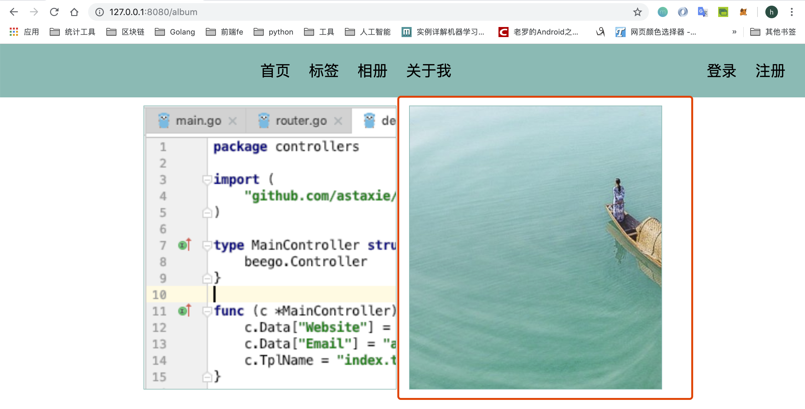

## Homepage function extension, picture upload and about me function development
**@author: Davie**  
**Copyright: Beijing Qianfeng Internet Technology Co., Ltd.**

Initially, we just let the home page display the article data of the first page. If the corresponding parameters are passed in when visiting the home page, then we should display the corresponding content according to the parameters.

If the browser enters the homepage URL: [http://127.0.0.1:8080/](http://127.0.0.1:8080/), then we display the article data of the first page

If the browser input URL is: [http://127.0.0.1:8080/?page=3](http://127.0.0.1:8080/?page=3), then we directly display the article data of the third page

If the browser input URL is: [http://127.0.0.1:8080/?tag=go](http://127.0.0.1:8080/?tag=go), then we should display all articles tagged with go In the same way, if tag=web, we should display all articles tagged with web.

Next, we will improve the function of the home page.
## One Homepage Function Extension Development
### 1.1 Modify the homepage logic
#### 1.1.1 Modify the controller logic
We first modify the processing in the home_controller.go file, and modify the code as follows:

```go
package controllers
import (
	"fmt"
	"myblogweb/models"
)
type HomeController struct {
	//beego.Controller
	BaseController
}

func (this *HomeController) Get() {
	tag := this.GetString("tag")
	fmt.Println("tag:", tag)
	page, _ := this.GetInt("page")
	var artList []models.Article
	if len(tag)> 0 {
		//Search according to the specified label
		artList, _ = models.QueryArticlesWithTag(tag)
		this.Data["HasFooter"] = false
	} else {
		if page <= 0 {
			page = 1
		}
		artList, _ = models.FindArticleWithPage(page)
		this.Data["PageCode"] = models.ConfigHomeFooterPageCode(page)
		this.Data["HasFooter"] = true
	}
	fmt.Println("IsLogin:", this.IsLogin, this.Loginuser)
	this.Data["Content"] = models.MakeHomeBlocks(artList, this.IsLogin)
	this.TplName = "home.html"
}
```

#### 1.1.2 Function expansion logic analysis
We first receive the value of tag and page:
Then there are three situations:
 	1. If the tag has a value, the page will not have a value. For example: [http://127.0.0.1:8080/?pag=web](http://127.0.0.1:8080/?pag=web)
 	2. If the page has a value, then the tag will not have a value. For example: [http://127.0.0.1:8080/?page=3](http://127.0.0.1:8080/?page=3)
 	3. The user directly visits the homepage without passing in tag or page: [http://127.0.0.1:8080](http://127.0.0.1:8080)
If it is the first case, then we should search by tag. If it is the second case, query according to the number of pages. If it is the third type, it will query by pagination by default, and only query the first page.

### 1.2 Model layer logic implementation
#### 1.2.1 Logical analysis
Next, let's implement the query according to the tag. There is a complicated place here, that is, we are writing the article. There may be one or more tags. If there are more than one, we connect according to &, for example : Go&socket. Then when querying by label, there are 4 situations:
```
Query the data of the homepage by label
There are four situations
   1. There are ampersands and other symbols on the left and right sides
   2. There are ampersands and other symbols on the left, and there is no symbol on the right
   3. There are ampersands and other symbols on the right, and there is no symbol on the left
   4. There are no symbols on the left and right sides
Use% to match any number of characters, at least one
```

#### 1.2.2 Add model method
We add a method to the article_model.go file:
```go
//--------------Search by label--------------
func QueryArticlesWithTag(tag string) ([]Article, error) {

	sql := "where tags like'%&" + tag + "&%'"
	sql += "or tags like'%&" + tag + "'"
	sql += "or tags like'" + tag + "&%'"
	sql += "or tags like'" + tag + "'"
	fmt.Println(sql)
	return QueryArticlesWithCon(sql)
}
```

### 1.3 Project operation
The front-end page does not need to be modified, we open the browser and enter the following URL: [http://127.0.0.1:8080?tag=web](http://127.0.0.1:8080?tag=web)


You can see the three articles with web tags queried, re-enter the URL: [http://127.0.0.1:8080?tag=http](http://127.0.0.1:8080?tag=http) under the http tag Three articles were also queried.


Below we enter the following page number: [http://127.0.0.1:8080?page=3](http://127.0.0.1:8080?page=3)


## Two file upload and picture display function
In the previous section, we learned about the expansion of the home page. In this lesson, we continue to develop and implement new functions-file upload and picture display functions. In the actual case, the photo album display function is provided. The pictures displayed by the photo album function need to be uploaded by files, and we will develop and implement it.

### 2.1 Create a data table
First, we need to create a data table in the database. To store pictures, we need the id of the picture, the path location of the picture, the name of the picture, and so on. In the mysqlUtil.go file located in the utils toolkit, add a method to create a data table:

```go
//--------picture--------
func CreateTableWithAlbum() {
	sql := `create table if not exists album(
		id int(4) primary key auto_increment not null,
		filepath varchar(255),
		filename varchar(64),
		status int(4),
		createtime int(10)
		);`
	ModifyDB(sql)
}
```

And call in the method of initializing the database:
```go
func InitMysql() {
	fmt.Println("InitMysql....")
	if db == nil {
		db, _ = sql.Open("mysql", "root:hanru1314@tcp(127.0.0.1:3306)/myblogweb")
		CreateTableWithUser()
		CreateTableWithArticle()
		CreateTableWithAlbum()
	}
}
```

### 2.2 Implement file upload function
#### 2.2.1 Add AlbumController controller
Then we create a new go file, album_controller.go
```go
package controllers
import (
	"myblog/models"
	"github.com/opentracing/opentracing-go/log"
)
type AlbumController struct {
	BaseController
}
func (this *AlbumController) Get() {
	this.TplName="album.html"
}
```

#### 2.2.2 View layer implementation
##### 2.2.2.1 Add html file
Next we go to write the html page and create a new html page in the views directory:
```html


    
   
    
    
    
    
    
   


{{template "block/nav.html" .}}

   

    
    
 
      
     

 
    


   


```

##### 2.2.2.2 js implements file upload logic
Then we need to write the script code after clicking the button, and continue to add the script in the blog.js file:
```go
//document
    $("#album-upload-button").click(function () {
        var filedata = $("#album-upload-file").val();
        if (filedata.length <= 0) {
            alert("Please select a file!");
            return
        }
        //File upload to store the data of the file through Formdata
        var data = new FormData()
        data.append("upload", $("#album-upload-file")[0].files[0]);
        alert(data)
        var urlStr = "/upload"
        $.ajax({
            url: urlStr,
            type: "post",
            dataType: "json",
            contentType: false,
            data: data,
            processData: false,
            success: function (data, status) {
                alert(":data:" + data.message);
                if (data.code == 1) {
                    setTimeout(function () {
                        window.location.href = "/album"
                    }, 1000)
                }
            },
            error: function (data, status) {
                alert("err:" + data.message + ":" + status)
            }
        })
    })
```

#### 2.2.3 Add file upload controller
At this point we need to create a new file upload controller, upload_controller.go
```go
package controllers

import (
	"fmt"
	"time"
	"path/filepath"
	"os"
	"io"
	"myblog/models"
)
type UploadController struct {
	BaseController
}
func (this *UploadController) Post() {
	fmt.Println("fileupload...")
	fileData, fileHeader, err := this.GetFile("upload")
	if err != nil {
		this.responseErr(err)
		return
	}
	fmt.Println("name:", fileHeader.Filename, fileHeader.Size)
	fmt.Println(fileData)
	now := time.Now()
	fmt.Println("ext:", filepath.Ext(fileHeader.Filename))
	fileType := "other"
	//Judging the file whose suffix is ​​picture, if it is a picture, we will save it in the database
	fileExt := filepath.Ext(fileHeader.Filename)
	if fileExt == ".jpg" || fileExt == ".png" || fileExt == ".gif" || fileExt == ".jpeg" {
		fileType = "img"
	}
	//Folder path
	fileDir := fmt.Sprintf("static/upload/%s/%d/%d/%d", fileType, now.Year(), now.Month(), now.Day())
	//ModePerm is 0777, so you have the execution permission of the folder path
	err = os.MkdirAll(fileDir, os.ModePerm)
	if err != nil {
		this.responseErr(err)
		return
	}
	//file path
	timeStamp := time.Now().Unix()
	fileName := fmt.Sprintf("%d-%s", timeStamp, fileHeader.Filename)
	filePathStr := filepath.Join(fileDir, fileName)
	desFile, err := os.Create(filePathStr)
	if err != nil {
		this.responseErr(err)
		return
	}
	//Copy the file uploaded by the browser client to the file on the local path
	_, err = io.Copy(desFile, fileData)
	if err != nil {
		this.responseErr(err)
		return
	}
	if fileType == "img" {
		album := models.Album{0, filePathStr, fileName, 0, timeStamp}
		models.InsertAlbum(album)
	}
	this.Data["json"] = map[string]interface{}{"code": 1, "message": "Uploaded successfully"}
	this.ServeJSON()
}

func (this *UploadController) responseErr(err error) {
	this.Data["json"] = map[string]interface{}{"code": 0, "message": err}
	this.ServeJSON()
}
```

#### 2.2.4 Add album and file upload route
Finally, register the route:
```go
//Album
beego.Router("/album", &controllers.AlbumController{})
//File Upload
beego.Router("/upload", &controllers.UploadController{})
```

#### 2.2.5 Add album model
##### 2.2.5.1 Album structure definition
Next we create a new model, album_model.go file:
```go
type Album struct {
	Id int
	Filepath string
	Filename string
	Status int
	Createtime int64
}
```

##### 2.2.5.2 Adding method
We need to add a method of inserting data in the album_model.go file:
```go
//-------Insert picture---------------
func InsertAlbum(album Album) (int64, error) {
	return utils.ModifyDB("insert into album(filepath,filename,status,createtime)values(?,?,?,?)",
		album.Filepath, album.Filename, album.Status, album.Createtime)
}
```

#### 2.2.6 Project Operation
After restarting the project, click the picture button, and then select a picture:


After clicking the submit file button, you can upload the picture.


We can query the database:


### 2.3 View image
The file can be uploaded through the above operation, so how to display the file? When you click on the picture label, in addition to uploading, it should be able to display the stored pictures.

#### 2.3.1 Model layer adding method
We now add a method to find image data in the album_model.go file:
```go
//--------Query picture----------
func FindAllAlbums() ([]Album, error) {
	rows, err := utils.QueryDB("select id,filepath,filename,status,createtime from album")
	if err != nil {
		return nil, err
	}
	var albums []Album
	for rows.Next() {
		id := 0
		filepath := ""
		filename := ""
		status := 0
		var createtime int64
		createtime = 0
		rows.Scan(&id, &filepath, &filename, &status, &createtime)
		album := Album{id, filepath, filename, status, createtime}
		albums = append(albums, album)
	}
	return albums, nil
}
```

#### 2.3.2 Modify the controller method
Next, we modify the Get() method in the album_controller.go file,
```go
func (this *AlbumController) Get() {
	albums,err := models.FindAllAlbums()
	if err !=nil{
		log.Error(err)
	}
	this.Data["Album"] = albums
	this.TplName="album.html"
}
```

#### 2.3.3 Modify the view layer
Finally, we have to modify the html page. In album.html, add the following content:
```html

   

    
    {{range .Album}}
        
    

    {{end}}

   

```

#### 2.3.4 Project Operation
After we upload a few pictures, refresh the page:


## Three about my function development and project summary
In this lesson, let’s develop and complete the last function of this series of courses-the function development of the About Me page. At the same time, we will review and summarize the contents of this series of courses.
### 3.1 About Me Function Development
#### 3.1.1 Add "About Me" controller
First create a new go file, aboutme_controller.go
```go
package controllers
type AboutMeController struct {
	BaseController
}
func (c *AboutMeController) Get() {
	c.Data["wechat"] = "WeChat: 13167758311"
	c.Data["qq"] = "QQ: 861574834"
	c.Data["tel"] = "Tel: 13167582311"
	c.TplName = "aboultme.html"
}
```
#### 3.1.2 Register About Me Routing Analysis
Then don't forget to register the route:
```go
//about me
beego.Router("/aboutme", &controllers.AboutMeController{})
```

#### 3.1.3 About Me View Layer
Then we have to write an html page, aboultme.html:
```html


    
   
    
    
   
    
   


{{template "block/nav.html" .}}


   

    
    
 
      
     
 
      

 {{.wechat}} 
 
      

 {{.qq}} 
 
      

 {{.tel}} 
 
     
 
    


   


```

### 3.2 Course Summary
After 16 sessions of course content, we have completed the development of a blog system using the Beego framework. Through this project, we hope that everyone can master the use of the Beego framework. Now let's review some important knowledge points that the Beego framework needs to master to develop a web project.
#### 3.2.1 Beego frame composition
The eight modules of the Beego framework are composed of **cache, config, context, httplibs, logs, orm, session, toolbox** and other modules. The modules are highly decoupled and have low dependency.

#### 3.2.2 Beego framework debugging tool
The use of Beego, the project management tool of the Beego framework, can facilitate developers to manage, debug, package projects, and automatically generate project directory structures.

#### 3.2.3 Beego program execution flow
**Beego framework execution flow: **The program execution flow of the Beego framework is shown in the figure below.


#### 3.2.4 Database operation
* Database linkage:
    * Driver: orm in beego supports MySQL, Sqlite3, PostgreSQL.
    * The configuration of user name, password, host, port number, database name, etc.
* Database operation:
    * sql statement
    * Condition query
    * Statistics function
    * Add (insert), delete (delete), modify (update), query (select)
    * Fuzzy query
    * Table association

#### 3.2.5 beego project architecture
* **mvc mode: **m (model) model layer, v (view) view layer, c (controller) controller layer.
    
* **Routing Analysis:**
    * Default routing: Beego module comes with corresponding methods for network request types such as Post, Put, Delete, Head, Options, Patch, etc.
    * Automatic routing (automatically map to Get, Post, Put, Delete, Head, Options, Patch and other methods.
    * Regular expression routing (support regular expressions and variables)
    * Custom routing: the developer specifies the routing resolution method by himself

* **Session processing:**
    * Two management methods:
        * Configuration file configuration session related configuration items
        * Configure in the program through SessionConfig
    
    * Operation method:
        * SetSession: Set the session value
        * GetSession: Get session value
        * DelSession: delete session value

* **Views view template:**
    * The views directory stores view template files
    
    * controller.TplName specifies the full name of the rendered page template file
    
    * The use of variables in the template file is achieved by **{{.param}}**
    
    * controller.Data["param"] assigns values ​​to the variables of the template page


