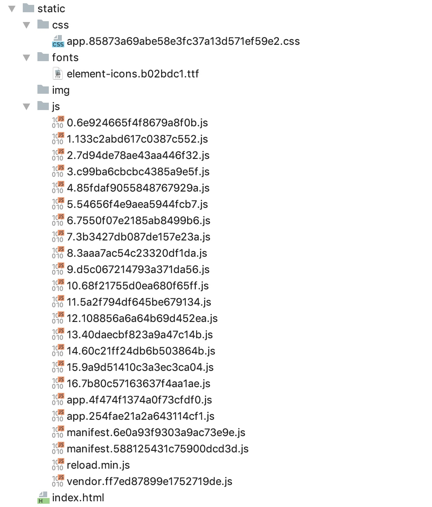

# Iris framework settings, mvc package, session use, project construction and resource import
**@author:Davie**  
**Copyright: Beijing Qianfeng Internet Technology Co., Ltd.** 

## One iris frame setting
### 1.1 The use of routing groups  
In actual development, we usually develop according to modules. Different interface URLs of the same module are often different from the last level URL and have the same prefix URL. Therefore, we expect that in the background development, we can process our requests according to the modules. For this kind of demand, the iris framework is also supported.
```
usersRouter := app.Party("/admin", userMiddleware)
```
As shown in the above code, the app.Party method is used in the iris framework to group requests. The second parameter is the middleware method for processing the routing group. Normally, we will write the context.Next() method in the middleware. .
### 1.2 In-app code configuration
In the development of the iris framework, the default configuration values ​​have been used when initializing the application. As a developer, we can start our application without additional configuration.
If developers want to configure themselves according to their own needs, the iris framework is also supported. In this lesson, we will learn about the configuration methods supported by the iris framework.
The current mainstream configuration file formats are: xml, yaml, cnf, toml, json and other formats. XML is not used much now. The configuration file in cnf format is suitable for the configuration file of the database. In this section, we will take you to learn how to use a variety of configuration files.
In the global app instance of the iris program, code configuration is supported in a variety of ways:
#### 1.2.1 app.Configure
Use app.Configure(iris.WithConfiguration(iris.Configuration{DisableStartuplog:false})) to configure configuration items for the overall application.
#### 1.2.2 app.Run
Configure related custom configuration items through the second parameter of the app.Run method. The type of the second parameter is the same as 1.  
The above two methods, no matter which method, is to configure the app service application. The configuration items supported by the Configuration structure definition that provide the application configuration are:
* DisableInterruptHandler: If set to true, when the program execution is interrupted manually, the server will not be automatically shut down normally. If set to true, you need to customize the processing yourself. The default is false.  
* DisablePathCorrection: This configuration item indicates correction and redirects the requested path to the registered path. For example: if /home/ is requested but the route handler cannot be found, then the router checks whether the /home handler exists, and if it is, (permant) redirects the client to the correct path /home. The default is false.
* EnablePathEscape: This configuration option is used to configure whether to support path escaping. It is suitable for configuration when the request url contains escape characters. The default is false.  
* FireMethodNotAllowed: The default is false. 
* DisableBodyConsumptionOnUnmarshal: This setting option is used to configure whether the method of reading request data is used. If set to true, it means that context.UnmarshalBody, context. ReadJSON and context.ReadXML are disabled. The default is false.
* DisableAutoFireStatusCode: This configuration variable is used to control whether to handle the error automatic execution, if it is true, the error automatic execution will not be carried out. This configuration item is false by default.
* TimeFormat: Time format. The default format is: "Mon, 02 Jan 2006 15:04:05 GMT"  
* Charset: Font format option. The default font is: "UTF-8"

### 1.3 Configuration via TOML configuration file  
#### 1.3.1 What is toml?
toml is the abbreviation of Tom's Obvious, Minimal Language, and toml is a configuration file. TOML is a language created in 2013 by the former GitHub CEO, Tom Preston-Werner, with the goal of becoming a small-scale, easy-to-use semantic configuration file format. TOML is designed to be unambiguously converted into a hash table (Hash table).
#### 1.3.2 toml file configuration
In the specific project configuration, we need to create a configuration file of type config.tml, and explicitly use the toml file to read the configuration content in the program. As shown in the figure below:
```
app.Configure(iris.WithConfiguration(iris.TOML("./configs/iris.tml")))
```
### 1.4 Via YAML configuration file  
YAML is a language specially used to write configuration files. It is simple and powerful, and it is more convenient than JSON format. Yaml is essentially a universal data serialization format. The main grammatical format of Yaml has the following items:
* Case Sensitive.
* Use indentation to indicate hierarchical relationships.
* Tab key is not allowed when indenting, only spaces are allowed.
* The number of spaces for indentation is not limited, and the configuration elements of the same level can be aligned to the left.
In this section, we can configure simple options for the application through the yaml configuration file:

```
app.Configure(iris.WithConfiguration(iris.))
```

### 1.5 By reading custom configuration files
Here we show you how to use the json format configuration file to configure the application, and then read it from the application.
#### 1.5.1 Custom json file
First create a configuration file in json format, and write configuration items, as shown below:

```
{
  "appname": "IrisDemo",
  "port": 8000
}
```

#### 1.5.2 Configuration file reading
In the application program, read and parse the configuration file by programming, as shown in the figure below:

```go
file, _ := os.Open("/Users/hongweiyu/go/src/irisDemo/5-Routing group and Iris configuration/config.json")
defer file.Close()
decoder := json.NewDecoder(file)
conf := Coniguration{}
err := decoder.Decode(&conf)
if err != nil {
	fmt.Println("Error:", err)
}
fmt.Println(conf.Port)
```

In this lesson, we have taken you to learn how to use routing groups and configure related applications in the iris framework. The content learned in this lesson can be used in actual combat projects.

## Two MVC package use
In the Iris framework, the mvc package is encapsulated as a support for the mvc architecture, which is convenient for developers to follow the mvc development principles for development.
The iris framework supports hierarchical processing of request data, models, and persistent data, and supports the binding and execution of module codes at various levels.
MVC means three parts: model, view, and controller, which represent the data layer, view layer, and control layer respectively. The controller layer is responsible for completing page logic, the entity layer is responsible for completing data preparation and data manipulation, and the view layer is responsible for displaying UI effects.
In the iris framework, a diagram is used to represent the request process diagram of the front-end request, the server processing the request, and the server returning data to the front-end. The description is as follows:


### 2.1 mvc.Application
The Application structure definition is provided in the mvc package in the iris framework. Developers can use the corresponding API provided by registering a custom controller, which includes the routing group router.Party, which is used to register layout, middleware, and corresponding handlers.

### 2.2 iris.mvc features
The mvc package encapsulated by the iris framework supports all http methods. For example, if you want to provide GET, then the controller should have a function called Get(). Developers can define multiple methods and functions to provide in the same Controller. The Get and Post methods here refer to the methods with the same name as the eight request types directly. The mvc module will automatically execute the eight corresponding methods such as Get() and Post(). As follows:
```go
//Custom controller
type CustomController struct{}
//Register a custom controller to handle the request
mvc.New(app).Handle(new(CustomController))
//Automatically process basic Http requests
//Url: http://localhost:8000
//Type: GET request
func (cc *CustomController) Get() mvc.Result{
    //todo
    return mvc.Response{
        ContentType: "text/html",
    }
}
/**
 * Url: http://localhost:8000
 * Type: POST
 **/
func (cc *CustomController) Post() mvc.Result{
    //todo
    return mvc.Response{}
}
```
### 2.3 Automatic matching processing method based on request type and request URL
In the mvc design package in the iris framework, after setting a custom controller, it supports automatic matching of the corresponding processing method according to the request type and the corresponding URL. The specific cases are as follows:
```go
/**
 * url: http://localhost:8000/info
 * type: GET request
 **/
func (cc *CustomController) GetInfo() mvc.Result{
    //todo
}

/**
 * url: http://localhost:8000/login
 * type: POST
 **/
func (cc *CustomController) PostLogin() mvc.Result{
    //todo
}
```
As in the above case, when we initiate a request, the iris framework can automatically match the processing method of the corresponding controller. In addition to the above-mentioned get and post methods, other request types among the eight types of http requests also support automatic matching.

### 2.4 BeforeActivation method
After the custom Controller is bound through Configure and Handle, you can use your own custom Controller to customize the processing request method. Developers can handle the request definition in the BeforeActivation method. As shown below, we give a case description:
```go
func (m *CustomController) BeforeActivation(a mvc.BeforeActivation){
    a.Handle("GET","/users/info","QueryInfo")
}
//Corresponding to the method of processing the request
func (m *CustomController) QueryInfo() mvc.Result{
    //todo
}
```

### 2.5 Use mvc.Configure to configure routing groups and controllers
In addition to using mvc.new (app) to build the mvc.Application structure object and the Handle method to configure the controller that processes the request, the iris framework also supports the use of mvc.Configure to configure the routing group and controller settings. The specific usage method is as follows:
```
mvc.Configure(app.Party("/user"), func(mvc *mvc.Application) {
		mvc.Handle(new(UserController))
})
```
In this lesson, we learned the basic usage of the controller and its processing methods in the mvc package. In actual combat projects, we will continue to learn more detailed operations based on the content of this lesson.

## The use and control of three sessions
In actual project development, we will often use the Session function in business scenarios. In the iris framework, it also provides us with a convenient and fully functional Session module. The source directory of the Session module is the kataras/iris/sessions package.
### 3.1 The difference between Session and Cookie
In the process of learning web development, we will always deal with sessions and cookies. In this lesson, we learn the knowledge related to sesion, so it is necessary to compare the difference between session and cookie through explanation:
* The first is the similarities between the two. Both session and cookie are used to store customer status information. After logging in, registering and other actions, the status information of the relevant account can be stored to facilitate the follow-up tracking and use of the program.
* The second is the difference. Discussing the differences between the two, we summarize from several perspectives. The first is the storage location of the two. Cookie is stored on the client's browser to facilitate the use of the client's request; the relevant information stored in the Session is stored on the server, and is used to store the status information of the client's connection.
* Secondly, from the data type that can be stored. Cookie only supports storing a data type of string, Session supports multiple data types such as int, string, bool, etc. Session supports more data types.

### 3.2 Session object creation
In actual program development, it is very convenient to create a new session object in the iris framework. As shown below, it is the creation of the session:
```go
...
sessionID := "mySession"
//session creation
sess := sessions.New(sessions.Config{
		Cookie: sessionID,
})
```
### 3.3 Supported data types
In the above, we said that the session supports more data types than cookies. Let's take a look at the data types that the session in the iris framework supports:
```go
//String: string type
session.GetString()
//Int: unsigned integer and the same type of series related units
session.GetInt()
//Boolean: Boolean value type
session.GetBoolean()
//Float: Single-precision numeric type and the same type of series related units
session.GetFloat()
//interface{}: interface is any data structure type
session.GetFlash()
```
The above code block lists the data types supported by the iris framework. We will demonstrate how to use it in the following course content of this section.

### 3.4 Use of Session
```go
...
session := sess.Start(ctx)
session.Set("key", "helloworld")
...
```

## Four actual combat project resource import and project framework construction
Starting from the content of this section, we will use the relevant knowledge of the Iris framework that we have learned to carry out actual project development.

### 4.1 Framework construction of actual combat project
Our actual combat project is to use the Iris framework to develop a background management platform on the local service platform. The platform can manage users, products, shops and other related information, and the platform can display the changes of users, products and other related monitoring data in real time. Through this project, the aim is to consolidate and practice knowledge related to the Iris framework.
The following are the instructions after the project framework is built:
* config: project configuration file and related functions for reading configuration files
* controller: the controller directory, the controller of each module of the project and the directory where the business logic is processed
* datasource: the directory that realizes mysql connection and operation, and encapsulates and operates the mysql database.
* model: data entity catalog, mainly the definition of the entity objects of each business module in the project
* service: Service layer directory. The basic function interface definition and realization for each module is the data layer of each module.
* static: configure the static resource directory of the project.
* Util: Provide a general method package.
* main.go: the main entrance of the project program
* config.json: project configuration file.

### 4.2 Project resource import
Because our actual project development is mainly to implement server-side function development and knowledge exercises of the Iris framework, we will focus on the background function development. For the front-end page and some layout effects, we don’t do in-depth research, just need to know how to use it. Will be able to debug.
Therefore, in this project, the resources we imported from the outside are mainly front-end resources. The front-end framework is written in Vue. In this project, we directly import the compiled js files, css files and other related files into the actual combat project, all of which are stored in the static directory, as shown in the following figure:


Google Translate
মূল পাঠ্য
因此，在该项目中，我们从外部导入的资源主要是前端的一些资源。
একটি আরও ভালো অনুবাদ দিন
